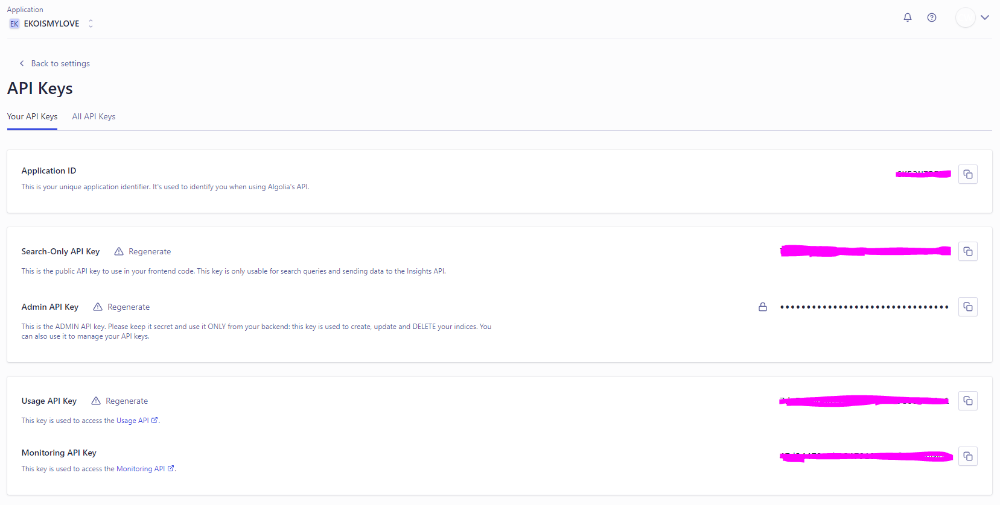
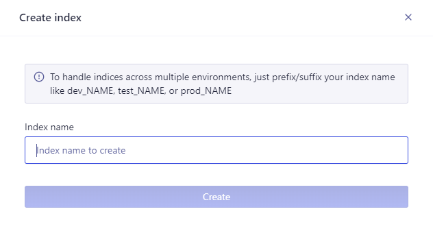
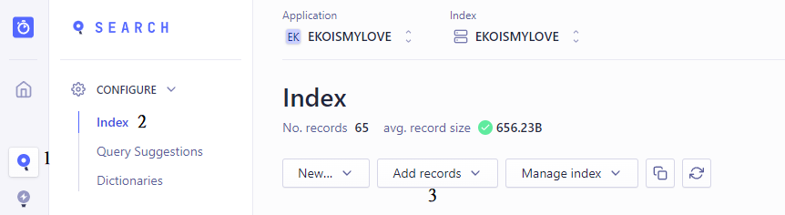

本篇文章會簡單介紹 algolia search，並且說明如何在 LoveIt 上啟用 Algolia search。
<!--more-->
---

## Algolia search 

### 介紹
Algolia search的宗旨是提供一個快速的搜尋體驗，並提供適用於多種不同 stack 的文件與工具，可以快速的建構搜尋功能，且搜尋功能只要利用 API 建立，不必花費太多時間建構。

另外可以分析搜尋結果，了解用戶到自己的網站搜尋了些甚麼，透過這些結果，可以自行定義，或是由 Algolia 自動生成較佳的搜尋規則。

### 優點
* 速度非常快。Algolia Search 基本上是將網站建立索引(index)，並建立了分佈式搜尋網路(Distributed Search Network,DSN)，盡可能使搜尋要求送到最近的 DataCenter，降低延遲。
* 提供了自動建議字、自動糾正錯別字等搜尋功能，另外也支援多種語言的搜尋。
* 有免費的方案可以使用，雖然有些地方有所限制，但對於小型開發者而言，這個免費方案應能滿足需求。或是使用免費的 Docsearch，他是基於 algolia 的文件搜尋，不過他只能用在技術文件或是技術Blog，但我的 Blog 審核一直沒有通過，所以沒辦法使用...(應該是因為我寫的很差)

## 建置

### 註冊帳號
首先到 Algolia 的[官方網站](https://www.algolia.com/)註冊帳號，基本上註冊的部分就不加以描述，而且我相信大家都有 Github account，algolia 也可以使用 Github 登入。

### Key 
註冊完成後，進到 Dashboard 並點選 API Keys，會獲得 Application ID，Search-Only API Key。
> 切記 : Admin API Key 絕對絕對絕對不要存放在任何地方。



### Index
從 Dashboard 點選 Search，並建立一個新的 index，這個 index 可以自己任意取一個容易識別的名稱。


接下來的步驟，會用到前述提到的 **Application ID**、**Search-Only API Key**與**index**。

## Algolia search config in LoveIt

LoveIt 主題已經將 Algolia search 的功能製作完成，只需要輸入相對應的設定到 ```config.toml``` 中即可。
這邊附上官方的[設定檔](https://hugoloveit.com/theme-documentation-basics/#site-configuration)。

```toml
 [params.search]
    enable = true
    # type of search engine ("lunr", "algolia")
    type = "algolia"
    # max index length of the chunked content
    contentLength = 4000
    # placeholder of the search bar
    placeholder = ""
    # LoveIt NEW | 0.2.1 max number of results length
    maxResultLength = 10
    # LoveIt NEW | 0.2.3 snippet length of the result
    snippetLength = 30
    # LoveIt NEW | 0.2.1 HTML tag name of the highlight part in results
    highlightTag = "em"
    # LoveIt NEW | 0.2.4 whether to use the absolute URL based on the baseURL in search index
    absoluteURL = false
    [params.search.algolia]
      index = ""
      appID = ""
      searchKey = ""
```
預設為 lunr 搜尋，請更換成 algolia。

在下方的部分，可以看到 index、appID 與 searchKey，請依據填入前述提到的數值。這裡的設定就完成，~~我們可以開始搜尋了。~~

## Record
當完成設定之後，其實這個搜尋功能已經建立起來了，但是因為我們還沒上傳相關的記錄，所以 algolia search 會回傳 0 筆結果，那要如何上傳記錄呢?

### Create records
請在您的 ```config.toml``` 新增 output 屬性 :
```toml
[outputs]
    home = ["HTML","RSS","JSON"]
    # Hugo 預設會生成 HTML 與 RSS，不建議刪除該兩參數，貌似會影響 Hugo 生成網頁的樣子。
```

設定完成後，我們執行 ```hugo```，讓他重新建置並輸出 json，沒有意外的話會在 ```public``` 資料夾內產生一個 ```index.json```，這個就是我們要的記錄檔，待會我們要上傳至 algolia search。

### Upload records

Dashboard -> search -> index -> Add records



然後把剛剛產生的 json 上傳，上傳完成後應該幾秒內，你的 algolia search 就能夠搜尋到相關的結果了。

### Auto upload
因為這個方式，當我們的 blog 有更新時，就必須手動上傳新的記錄，那能不能使用程式上傳呢 ?

> Ans : 官方有提供API，當然可以。

[官方文件](https://www.algolia.com/doc/guides/sending-and-managing-data/send-and-update-your-data/how-to/sending-records-in-batches/) 有詳細說明使用方式與一些 example code，基本上官方文件提供的程式碼就可以滿足我們的需求。因為都使用 Hugo 了，基本上 go 的環境應該是沒問題。我這邊就使用官方提供的 go 範例做使用。

> tips : 記得要更改的參數與路徑。

```go
package main

import (
    "encoding/json"
    "io/ioutil"

    "github.com/algolia/algoliasearch-client-go/v3/algolia/search"
)

type Actor struct {
    Name            string `json:"name"`
    Rating          int    `json:"rating"`
    ImagePath       string `json:"image_path"`
    AlternativeName string `json:"alternative_name"`
    ObjectID        string `json:"objectID"`
}

func main() {
    client := search.NewClient("appID", "Admin API Key")
    index := client.InitIndex("index")

    var actors []Actor
    data, _ := ioutil.ReadFile("public/index.json")
    _ = json.Unmarshal(data, &actors)

    // Batching is done automatically by the API client
    _, _ = index.SaveObjects(actors)
}
```

之後在 push repo 時，一併記得要執行這個更新記錄的程式即可。

## 參考資料(Reference)

1. [Algolia](https://www.algolia.com/)
2. [LoveIt](https://hugoloveit.com/theme-documentation-basics/#site-configuration)
3. [Sending Records in Batches](https://www.algolia.com/doc/guides/sending-and-managing-data/send-and-update-your-data/how-to/sending-records-in-batches/)